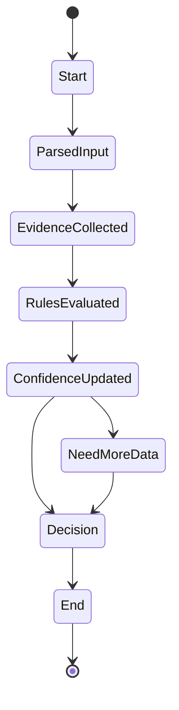

# Клетки анализа (Analysis Cells)

<!-- neira:meta
id: NEI-20250317-120000-analysis-cells-cell-template
intent: docs
summary: Обновлены ссылки на схемы cell-template.
-->
<!-- neira:meta
id: NEI-20250305-analysis-runtime-term
intent: docs
summary: Список языков дополнен упоминанием runtime на Node.js.
-->
<!-- neira:meta
id: NEI-20250508-analysis-training-examples
intent: docs
summary: Добавлена ссылка на программу обучения и примеры на русском языке.
-->

## Навигация

- [Обзор Нейры](README.md)
- [Клетки действий](action-cells.md)
- [Клетки анализа](analysis-cells.md)
- [Клетки памяти](memory-cells.md)
- [Архитектура анализа](analysis-architecture.md)
- [Поддерживающие системы](support-systems.md)
- [Личность Нейры](personality.md)
- [Шаблон клетки](cell-template.md)
- [Политика источников](source-policy.md)
- [Механизм саморазвивающейся системы](self-updating-system.md)

> **Важно:** подробная программа обучения находится в разделе [«Программа обучения клеток анализа»](#программа-обучения-клеток-анализа).

## Оглавление

- [CellTemplate](#celltemplate)
- [1. Базовый интерфейс клетки](#1-базовый-интерфейс-клетки)
  - [Сериализация и версионирование](#сериализация-и-версионирование)
- [2. Иерархия и назначение подтипов](#2-иерархия-и-назначение-подтипов)
- [3. Взаимодействие клеток анализа с подсистемами](#3-взаимодействие-клеток-анализа-с-подсистемами)
- [4. Фильтрация и весовка источников](#4-фильтрация-и-весовка-источников)
- [5. Pipeline создания новых подтипов](#5-pipeline-создания-новых-подтипов)
- [6. Приоритеты начального обучения](#6-приоритеты-начального-обучения)
- [7. Автономное расширение](#7-автономное-расширение)
- [8. Управление клеткими через редактор](#8-управление-клеткими-через-редактор)
- [9. Редактор и пометка ошибок](#9-редактор-и-пометка-ошибок)
- [10. Архитектура анализа](analysis-architecture.md) — обзор API, иерархии клеток и пример расширения на Rust
- [11. Счётчик ревизий и критерий улучшения](#11-счётчик-ревизий-и-критерий-улучшения)
- [12. Стратегия многоязычности](#12-стратегия-многоязычности)
- [13. Перспективные и устойчивые технологии](#13-перспективные-и-устойчивые-технологии)
- [14. A/B‑тестирование и откат](#14-ab-тестирование-и-откат)
- [15. Регистрация клеток и управление версиями](#15-регистрация-клеток-и-управление-версиями)
- [Revision Engine](#revision-engine)
- [Программа обучения клеток анализа](#программа-обучения-клеток-анализа)

## Правила оформления

- Используется нейтральный технический стиль.
- Термины применяются последовательно и в единой форме.
- При расширении документа следует сохранять указанный стиль и терминологическое единство.

### Оценка качества

Работа клетки характеризуется следующими метриками:

- **достоверность** — доля подтверждённых выводов относительно общего числа проверок;
- **актуальность** — возраст использованных данных, измеряемый в днях;
- **востребованность** — частота обращений к клетке за отчётный период.

Каждый клетка задаёт собственный `confidence_threshold`, который сравнивается с `quality_metrics.credibility` и определяет, можно ли использовать результат без дополнительной проверки.

```rust
struct QualityMetrics {
    credibility: f32,    // 0..1
    recency_days: u32,   // возраст данных
    demand: u32,         // число запросов
}
```

**Пример `AnalysisResult`**

```json
{
  "id": "example.analysis",
  "output": "analysis summary",
  "status": "active",
  "quality_metrics": {
    "credibility": 0.95,
    "recency_days": 7,
    "demand": 42
  },
  "reasoning_chain": ["fetch sources", "aggregate signals"],
  "links": ["memory.cell"],
  "explanation": "aggregated analysis",
  "uncertainty_score": 0.05,
  "metadata": { "schema": "1.0.0" }
}
```

Поля `id` и `output` обязательны и сериализуются строками. `quality_metrics` — объект с числовыми метриками; отсутствующие показатели опускаются. `status` фиксирует состояние клетки (`draft`, `active`, `deprecated`, `error`), `reasoning_chain` сохраняет этапы вывода, `links` перечисляет связанные клетки, `explanation` содержит краткое пояснение, а `uncertainty_score` отражает уровень сомнения (`0` — полная уверенность). `metadata.schema` указывает версию формата.

Поле `analysis_type` относится к описанию клетки и в `AnalysisResult` не сериализуется.

После выполнения `analyze()` клетка анализа всегда передаёт рассчитанные
`QualityMetrics` и `uncertainty_score` в связанный `MemoryCell`, например через метод
`push_metrics()`.

### Пример HTTP/JSON/TOML вызова

Запрос к API клеток анализа принимает параметры задачи и возвращает результат с метриками качества.

```http
POST /api/neira/analysis HTTP/1.1
Host: localhost:4000
Content-Type: application/json

{
  "id": "example.analysis",
  "analysis_type": "summary",
  "input": "Describe project Neira"
}
```

Ответ:

```http
HTTP/1.1 200 OK
Content-Type: application/json

{
  "id": "example.analysis",
  "output": "Neira — саморазвивающийся модуль...",
  "quality_metrics": { "credibility": 0.95, "recency_days": 7, "demand": 42 },
  "status": "active"
}
```

Эквивалент в формате TOML:

```toml
id = "example.analysis"
analysis_type = "summary"
input = "Describe project Neira"
```

Каждый клетка должен проверять `cancel_token` перед длительными вычислениями и
сохранять промежуточное состояние в чекпоинты, чтобы обеспечивать возобновление
после остановки.

### Правило-ориентированная реализация (ранние версии)

На этапе MVP клетка анализа может работать как простой классификатор по ключевым словам:

- разработчик задаёт список `keywords` и соответствующие ответы или теги;
- метод `analyze()` ищет эти ключи во входном тексте и возвращает заранее подготовленный `output`.

В такой схеме поля `id`, `analysis_type`, `keywords`, `output` и `confidence_threshold` заполняются вручную. Позже списки ключевых слов могут пополняться автоматически, а формирование результата — переходить к обучаемым моделям и векторным индексам.

### Шаблон раздела

````markdown
#### <Название подтипа>

- **Назначение:** краткое описание роли подтипа.
- **Пример:**

```json
{
  "id": "example.id",
  "type": "<Название>"
}
```

- **Метаданные:**

```yaml
schema: "1.0.0"
source: "https://example.org"
```
````

## 📘 Программа обучения клеток анализа

Общий график этапов описан в [дорожной карте](roadmap.md#зачаточный-этап), а сведения о загрузке тренировочных данных см. в [инструкции](training.md#загрузка-обучающих-данных).

### Уровень 0. Бинарная логика

- **Цель:** формирование цепочки рассуждений на основе операций AND/OR/NOT/XOR и импликации.
- **Пример:**

```json
{
  "task": "(A AND B) -> C",
  "reasoning_chain": ["evaluate A AND B", "apply implication to C"]
}
```

- **Пример (русский язык):**

```json
{
  "task": "Содержит ли предложение слово \"кот\"?",
  "reasoning_chain": ["разделить предложение на слова", "проверить наличие \"кот\""]
}
```

- **Критерии перехода:**
  - точность ≥ 95 % на тестовом наборе;
  - объяснимость шагов через `reasoning_chain`;
  - фиксация `quality_metrics` и `uncertainty_score`.

### Уровень 1. Числовая логика

- **Цель:** использование арифметических и статистических зависимостей для подтверждения выводов.
- **Пример:**

```json
{
  "task": "average of [2,4,6,8]",
  "reasoning_chain": ["sum elements", "divide by count"]
}
```

- **Пример (русский язык):**

```json
{
  "task": "средняя длина слов в \"мама мыла раму\"",
  "reasoning_chain": ["разделить фразу на слова", "суммировать длины", "разделить на количество"]
}
```

- **Критерии перехода:**
  - правильность вычислений;
  - корректное описание `reasoning_chain`;
  - точность ≥ 95 % и обоснованный `uncertainty_score`.

### Уровень 2. Условная логика и ветвления

- **Цель:** построение многошаговых выводов с явной проверкой каждой ветки.
- **Пример:**

```json
{
  "task": "if A then B else C",
  "reasoning_chain": ["check A", "branch to B or C", "merge result"]
}
```

- **Пример (русский язык):**

```json
{
  "task": "определи род слова \"машина\"",
  "reasoning_chain": ["проверить окончание \"а\"", "ветвление: если да -> женский, иначе -> мужской"]
}
```

- **Критерии перехода:**
  - корректная обработка вложенных условий;
  - разрешение конфликтующих правил;
  - точность ≥ 95 % и документированные `quality_metrics`.

### Уровень 3. Неопределённость и вероятности

- **Цель:** работа с неполной информацией и оценка достоверности.
- **Пример:**

```json
{
  "task": "Bayes update P(H|E)",
  "reasoning_chain": ["prior P(H)", "likelihood P(E|H)", "normalize"]
}
```

- **Пример (русский язык):**

```json
{
  "task": "обнови P(русский|текст содержит \"ё\")",
  "reasoning_chain": ["prior P(русский)", "likelihood P(\"ё\"|русский)", "нормализация"]
}
```

- **Критерии перехода:**
  - корректный расчёт вероятностей;
  - обоснование уровня уверенности `uncertainty_score`;
  - точность ≥ 95 % и полнота `quality_metrics`.

### Уровень 4. Абстрактное и творческое мышление

- **Цель:** генерация гипотез и перенос знаний между доменами.
- **Пример:**

```json
{
  "task": "find analogy between code refactoring and urban planning",
  "reasoning_chain": [
    "identify shared patterns",
    "map principles",
    "summarize analogy"
  ]
}
```

- **Пример (русский язык):**

```json
{
  "task": "придумай аналогию между русским алфавитом и нотами",
  "reasoning_chain": ["соотнести буквы и звуки", "построить аналогию", "описать вывод"]
}
```

- **Критерии перехода:**
  - формулирование новых связей на базе предыдущих уровней;
  - пояснение `reasoning_chain` и влияния на вывод;
  - точность ≥ 95 % и обоснованный `uncertainty_score`.

#### Общая методика

- Прогрессивная сложность: переход к следующему уровню допускается только при достижении 95 % точности.
- Контроль качества: для каждой задачи фиксируются `quality_metrics`, `reasoning_chain` и `uncertainty_score`, отчёты сохраняются в `MemoryCell`.
- Автономность: после уровня 2 клетки могут инициировать создание подтипов; на уровне 4 — предлагать и проверять гипотезы.

## CellTemplate

| Поле                   | Тип                 | Обязательное           | Описание                                                                           |
| ---------------------- | ------------------- | ---------------------- | ---------------------------------------------------------------------------------- |
| `id`                   | string              | да                     | Уникальный идентификатор шаблона.                                                  |
| `analysis_type`        | string              | да                     | Тип создаваемого клетки.                                                             |
| `links`                | array&lt;string&gt; | нет, по умолчанию `[]` | Список связей с другими клеткими, сериализуется массивом строк.                      |
| `confidence_threshold` | number              | нет                    | Минимальная допустимая `credibility` для принятия результата.                      |
| `draft_content`        | string              | нет                    | Черновое содержимое клетки.                                                          |
| `metadata`             | object              | да                     | Дополнительные метаданные в формате ключ‑значение. Должно содержать поле `schema`. |

```rust
struct CellTemplate {
    id: String,
    analysis_type: String,
    links: Vec<String>,
    confidence_threshold: f32,
    draft_content: String,
    metadata: HashMap<String, String>,
}
```

Поля сериализуются в JSON с `snake_case`. `links` передаётся как массив строк, `metadata` — как объект; отсутствующие необязательные поля опускаются.

### Преобразование CellTemplate → AnalysisCell

| Поле CellTemplate      | Поле AnalysisCell      |
| ---------------------- | ---------------------- |
| `id`                   | `id`                   |
| `analysis_type`        | `analysis_type`        |
| `links`                | `links`                |
| `confidence_threshold` | `confidence_threshold` |
| `metadata`             | `metadata`             |
| `draft_content`        | —                      |

Поля `status`, `reasoning_chain` и `uncertainty_score` в шаблон не входят, поскольку задаются или вычисляются после ревью.

**Пример (JSON)**

```json
{
  "id": "example.template",
  "analysis_type": "ProgrammingSyntaxCell",
  "links": ["prog.syntax.base"],
  "confidence_threshold": 0.8,
  "draft_content": "Initial description",
  "metadata": {
    "schema": "1.1.0",
    "source": "https://example.org"
  }
}
```

→

```json
{
  "id": "example.template",
  "analysis_type": "ProgrammingSyntaxCell",
  "links": ["prog.syntax.base"],
  "status": "draft",
  "confidence_threshold": 0.8,
  "reasoning_chain": ["initial review complete"],
  "uncertainty_score": 0.2,
  "metadata": {
    "schema": "1.1.0",
    "source": "https://example.org"
  }
}
```

**Пример (YAML)**

```yaml
id: example.template
analysis_type: ProgrammingSyntaxCell
links:
  - prog.syntax.base
confidence_threshold: 0.8
draft_content: Initial description
metadata:
  schema: "1.1.0"
  source: "https://example.org"
```

→

```yaml
id: example.template
analysis_type: ProgrammingSyntaxCell
links:
  - prog.syntax.base
status: draft
confidence_threshold: 0.8
reasoning_chain:
  - initial review complete
uncertainty_score: 0.2
metadata:
  schema: "1.1.0"
  source: "https://example.org"
```

**Проверка перед ревью:** сохраните шаблон в файл и проверьте его с помощью JSON Schema, например командой `npx ajv validate -s schemas/v1/cell-template.schema.json -d cell-template.json`. Для YAML используйте `npx ajv validate -s schemas/v1/cell-template.schema.json -d cell-template.yaml` или `yamllint` для проверки синтаксиса.

## 1. Базовый интерфейс клетки

- **Интерфейс:** `AnalysisCell`
- **Свойства:** идентификатор, `analysis_type`, `links`, `confidence_threshold`, `reasoning_chain`, `uncertainty_score`.
- **Методы:** `analyze()`, `explain()`, `updateContext()` и т. п.
- **Назначение:** единый контракт для всех типов клеток, обеспечивающий расширяемость и полиморфизм.

### Сериализация и версионирование

Клетки сохраняются и передаются в формате JSON или YAML по следующей схеме:

```yaml
id: string # обязательный
analysis_type: string # обязательный
links: # обязательный, список ID связанных клеток
  - string
confidence_threshold: number # 0..1, опционально
status: string # обязательный (draft|active|deprecated|error)
reasoning_chain: # опционально, шаги рассуждений
  - string
uncertainty_score: number # 0..1, опционально
metadata: # опционально
  schema: "1.0.0" # версия схемы
```

Версионирование определяется полем `metadata.schema` и следует [Semantic Versioning](https://semver.org/). `MAJOR` меняется при несовместимых изменениях, `MINOR` — при добавлении опциональных полей, `PATCH` — при исправлении описаний.

**Обязательные поля:** `id`, `analysis_type`, `links`, `status`, `metadata.schema`.
**Опциональные поля:** `confidence_threshold`, `reasoning_chain`, `uncertainty_score`, остальные элементы `metadata`.

При сериализации используется `snake_case`. Поля `links` и `reasoning_chain` кодируются как массивы строк, отсутствующие опциональные поля опускаются. `status` и `analysis_type` передаются строковыми литералами, `metadata` — объектом ключ‑значение.

Поле `status` фиксирует жизненный цикл клетки: `draft` — в разработке, `active` — готов к использованию, `deprecated` — устарел и подлежит замене, `error` — содержит ошибки и не должен применяться. `reasoning_chain` формируется как упорядоченный список шагов, добавляемых клеткой во время работы методов `analyze()` и `updateContext()`, что позволяет проследить логическую цепочку рассуждений.

#### Пример `ProgrammingSyntaxCell`

```json
{
  "id": "prog.syntax.python.for",
  "analysis_type": "ProgrammingSyntaxCell",
  "confidence_threshold": 0.95,
  "links": ["prog.syntax.iteration"],
  "status": "active",
  "reasoning_chain": ["tokenized input", "matched for-loop grammar"],
  "uncertainty_score": 0.05,
  "metadata": {
    "schema": "1.0.0",
    "language": "Python",
    "example": "for i in range(10): print(i)"
  }
}
```

### reasoning_chain и uncertainty_score

**Формат хранения**

- `reasoning_chain` — упорядоченный список шагов рассуждений. Рекомендуется хранить как массив строк или объектов `{ step, timestamp }` для фиксации хронологии.
- `uncertainty_score` — число в диапазоне `0..1`, где `0` означает полную уверенность, `1` — максимальную неопределённость.

**Псевдокод обновления**

```pseudocode
analyze(input):
    reasoning_chain.append("parsed input tokens")
    evidence = gather_evidence(input)
    reasoning_chain.append("evaluated grammar rules")
    confidence = calc_confidence(evidence)
    uncertainty_score = 1 - confidence
```

**Диаграмма переходов**



**Описание состояний**

- `Start` — цепочка пуста перед началом анализа.
- `ParsedInput` — входное сообщение преобразовано в токены.
- `EvidenceCollected` — собраны факты и контекст для проверки.
- `RulesEvaluated` — применены грамматические и доменные правила.
- `ConfidenceUpdated` — вычислены `confidence` и `uncertainty_score`.
- `NeedMoreData` — текущих данных недостаточно для уверенного вывода.
- `Decision` — клетка формирует ответ или запрашивает дополнительные сведения.
- `End` — обработка завершена.

Каждый шаг в `reasoning_chain` отражает конкретное действие или вывод. `uncertainty_score` пересчитывается после каждого значимого шага на основе доступных данных.

**Влияние на принятие решений**

Результат выдаётся только если `confidence` (или `1 - uncertainty_score`) не ниже `confidence_threshold`. Высокий `uncertainty_score` или короткая `reasoning_chain` сигнализируют о нехватке данных, и клетка обязан явно сообщить об этом, запросить дополнительную информацию или активировать резервные модули.

**Взаимодействие с `confidence`**

- `confidence` — текущая оценка надёжности вывода; обычно вычисляется как `1 - uncertainty_score`.
- `confidence_threshold` — минимальное значение `confidence`, при котором ответ считается приемлемым. Если `confidence < confidence_threshold` (или `uncertainty_score > 1 - confidence_threshold`), клетка возвращает статус `low_confidence` или `need_more_data` и может запросить дополнительные данные.

**Пример (JSON)**

```json
{
  "id": "prog.syntax.python.for",
  "analysis_type": "ProgrammingSyntaxCell",
  "status": "active",
  "confidence": 0.84,
  "confidence_threshold": 0.8,
  "reasoning_chain": [
    "tokenized input",
    "matched for-loop grammar",
    "validated loop bounds"
  ],
  "uncertainty_score": 0.16,
  "metadata": {
    "schema": "1.0.0",
    "language": "Python"
  }
}
```

**Пример (YAML)**

```yaml
id: prog.syntax.python.for
analysis_type: ProgrammingSyntaxCell
status: active
confidence: 0.84
confidence_threshold: 0.8
reasoning_chain:
  - tokenized input
  - matched for-loop grammar
  - validated loop bounds
uncertainty_score: 0.16
metadata:
  schema: "1.0.0"
  language: Python
```

Высокий `uncertainty_score` указывает на недостаточную доказательную базу. В таких случаях клетка должен сигнализировать о нехватке данных, запросить дополнительную информацию или воспользоваться резервными источниками.

## 2. Иерархия и назначение подтипов

| Подтип                     | Назначение                                                                                                           |
| -------------------------- | -------------------------------------------------------------------------------------------------------------------- |
| Синтаксические             | Разбор структуры языка, токенизация, грамматика.                                                                     |
| Семантические              | Определение смысловых связей, контекста и онтологических отношений.                                                  |
| Доменные                   | Работа с отраслевыми знаниями (медицина, программирование и т. д.).                                                  |
| Интеграционные             | Сбор и объединение результатов других клеток, построение итоговых планов и ответов.                                   |
| Метакогнитивные            | Самоанализ, корректировка ошибок, оптимизация алгоритмов.                                                            |
| Целевые (Task/Goal)        | Расчленение запросов на задачи, выбор действий для достижения целей.                                                 |
| Точные (Deterministic)     | Верификация утверждений, проверяемые расчёты, приоритет достоверных данных.                                          |
| Гипотетические             | Работа в условиях недостатка данных: уточнения, оценка надежности источников, предупреждения о низкой точности.      |
| Эмоционального анализа     | Определение эмоционального состояния пользователя и аккуратная реакция на негатив.                                   |
| Обман/Сокрытие (Deception) | Режим, где сообщается частичная или альтернативная информация в ситуациях требования скрытия деталей.                |
| Скептические               | Проверка достоверности спорных источников, фильтрация псевдонаучных утверждений.                                     |
| Логических ловушек         | Распознавание и нейтрализация когнитивных и риторических заблуждений (ошибка большинства, «ошибка выжившего» и др.). |
| BinaryCell                 | Булева логика, проверка истинности.                                                                                  |
| NumericCell                | Арифметика и пропорции.                                                                                              |
| ConditionalCell            | Ветвления и деревья решений.                                                                                         |
| ProbabilisticCell          | Вероятностные выводы.                                                                                                |
| AbstractCell               | Аналогии и концептуальные карты.                                                                                     |
| ArtisticCell               | Логика композиции и контрастов.                                                                                      |

**Подтипы «Метакогнитивные» дополнительно включают:**

- Ошибка‑анализ: локализация и классификация сбоев.
- Логика опыта: использование заранее заложенных философских и эвристических размышлений.

## 3. Взаимодействие клеток анализа с подсистемами

### Единый оркестратор (SynapseHub)

- Все запросы пользователя проходят через оркестратор.
- AnalysisCell создаёт контекст запроса и обращается к MemoryCell или ActionCell только через SynapseHub, что обеспечивает проверку прав доступа и логирование.
- Ответы клеток агрегируются обратно в оркестратор, который связывает цепочку Analysis⇄Memory⇄Action, вычисляет степень уверенности и формирует итог.

### Планировщик задач (TaskScheduler)

- Каждый запрос классифицируется по ожидаемой продолжительности и выделяемым ресурсам:
  - **`fast`** — короткие операции, которые завершаются менее чем за минуту и выполняются синхронно.
  - **`standard`** — типовые задачи до 30 минут; пользователь может получать промежуточные уведомления о ходе выполнения.
  - **`long`** — ресурсоёмкие вычисления до 8 часов, обрабатываются асинхронно с периодическими отчётами о прогрессе.
- AnalysisCell оценивает требуемое время и отправляет задачу в соответствующую очередь.
- Для долгих задач система возвращает пользователю идентификатор операции и периодически уведомляет о прогрессе.

- TaskScheduler использует три приоритетные очереди:
  - `high` — критичные задачи;
  - `medium` — стандартные задания;
  - `low` — фоновые операции.
- Планировщик выбирает задачи из очередей в порядке приоритета; `high` может прерывать выполняющиеся `low`, возвращая их в очередь.
- При длительном ожидании TaskScheduler пересматривает приоритет: задачи, превысившие SLA, повышаются, а многократно сбойные переводятся в `low`.
- Задачи проходят состояния `queued → running → completed/failed` с возможным возвратом в очередь при повторе.
- Каждая задача описывается структурой:

```rust
struct Task {
    id,
    kind,
    params,
    priority,      // high | medium | low
    timeout_ms,
    retry_count,
    max_retries,
    cell_refs,
}
```

- Таймаут и политика повторов:
  - `timeout_ms` задаёт максимальное время выполнения; по истечении задача помечается как failed.
  - `max_retries` определяет число автоматических повторов с экспоненциальной задержкой.
  - При отмене вручную или по превышению лимитов задача убирается из очереди.
- Системная функция отмены:

```pseudo
cancel(task_id):
    locate(task_id)
    if task.state == running:
        signal_worker_stop(task)
    remove_from_queue(task)
```

- Схема переходов между состояниями:
  - `queued → running` — задача взята воркером;
  - `running → completed` — успешное завершение;
  - `running → failed` — ошибка, таймаут или отмена;
  - `failed → queued` — повторная попытка до `max_retries`;
  - `queued → failed` — отмена до старта.

#### Пример обработки долгого запроса

1. Пользователь отправляет сложный запрос.
2. SynapseHub регистрирует его и передаёт в очередь `long`.
3. AnalysisCell делит задачу на подэтапы, обращаясь к MemoryCell и вызывая ActionCell.
4. По мере выполнения TaskScheduler сообщает оркестратору о статусе, а тот — пользователю.
5. После завершения результаты агрегируются в SynapseHub и возвращаются пользователю.

Дополнительные детали см. в разделе [поддерживающих систем](support-systems.md).

### Детекция триггеров

- AnalysisCell парсит поток ввода и нормализует токены.
- Сопоставляет их с заранее определённым словарём триггеров.
- При совпадении формирует команду для ActionCell с перечнем клеток памяти для предзагрузки.

Каждый клетка анализа после выполнения `analyze()` обязан вызвать `push_metrics()` и синхронизировать показатели качества с соответствующим клеткой памяти (см. [«Оценка качества»](#оценка-качества) и [memory-cells.md](memory-cells.md)).

## 4. Фильтрация и весовка источников

- **Фильтрация источников:** отдельные списки доверенных книг, статей и сайтов; GitHub‑репозитории только с релизами `v1.0+`.
- **Система весов:** каждому источнику назначается рейтинг надёжности на основе факта публикации, цитируемости и согласованности с уже проверенными знаниями.
- **Квота на «воду»:** фиксируется доля описательных блоков и формализованных правил; клетки отклоняют материал, где структурированных знаний недостаточно.

Рейтинг источника вычисляется по формуле:

```
rating = w_rel * reliability + w_cit * citations - w_err * error_count
```

| Вес     | Примерное значение | Объяснение                                            |
| ------- | ------------------ | ----------------------------------------------------- |
| `w_rel` | `0.5`              | Надёжность источника — основная доля рейтинга.        |
| `w_cit` | `0.3`              | Цитируемость подтверждает ценность и актуальность.    |
| `w_err` | `0.2`              | Штраф за обнаруженные ошибки снижает итоговую оценку. |

```rust
fn rate_source(meta: &SourceMeta) -> f32 {
    meta.w_rel * meta.reliability
        + meta.w_cit * meta.citations
        - meta.w_err * meta.error_count
}
```

Шаблон таблицы для хранения результатов:

| id  | rating | last_review | error_history |
| --- | ------ | ----------- | ------------- |
|     |        |             |               |

### Механизм рейтингов и пороги достоверности

- Источники получают числовой рейтинг в диапазоне `0..1`.
- Оценка формируется из типа публикации, цитируемости, истории ошибок и совпадения с уже подтверждёнными клеткими.
- Факты автоматически принимаются при рейтинге `≥ 0.7`; значения `0.4–0.7` помечаются как гипотезы и отправляются на дополнительную проверку, ниже `0.4` — отклоняются.
- Рейтинг хранится вместе с клеткой; при падении ниже рабочего порога клетка помечается для пересмотра.
- Порог может корректироваться в зависимости от контекста задачи и указаний редактора.

### Контроль качества и защита от шума

- Согласованность между источниками: новый факт принимается только при подтверждении двумя независимыми источниками.
- Аудит ошибок: при обнаружении несоответствий клетка формирует заявку на пересмотр источников.
- Регулярная переоценка: периодические задачи проверяют популярные клетки на предмет устаревания.

Дополнительные правила отбора и лицензирования изложены в [политике источников](source-policy.md).

- [Механизм саморазвивающейся системы](self-updating-system.md)

## 5. Pipeline создания новых подтипов

**Этапы конвейера:** Ингестор → Дедупликация → Шаблонизатор → Review → Регистрация.

1. **Ингестор** собирает данные из внешних источников (API, репозитории, публикации) и приводит их к единому формату.
2. **Дедупликация** сравнивает поступившие факты с текущей базой; дубликаты удаляются, а конфликтующие значения помечаются для ручной проверки.
3. **Шаблонизатор** формирует из очищенных данных черновой `CellTemplate`, заполняя описание, связи и исходные рейтинги.
4. **Review**: эксперт получает `CellTemplate`, проверяет его по чек‑листу и возвращает `AnalysisCell` со статусом `draft`, `approved` или `rejected`.
5. **Регистрация** заносит подтверждённый клетка в реестр; идентификатор и метаданные сохраняются для дальнейшего обучения.

Входом этапа служит `CellTemplate`, выходом — `AnalysisCell` с полем `status`, отражающим решение ревьюера.

```rust
fn review_template(template: CellTemplate) -> AnalysisCell {
    let mut cell = AnalysisCell::from(template);
    cell.status = if expert_checklist(&cell) {
        "approved"
    } else {
        "rejected"
    };
    cell
}
```

### Чек-лист эксперта

- **Источники:** указаны проверяемые ссылки на публикации или репозитории.
- **Полнота:** заполнены ключевые поля и метаданные клетки.
- **Связи:** корректно установлены ссылки на связанные `AnalysisCell`.

Пример записи нового клетки с метаданными `source`, `timestamp` и `reviewer`:

```json
{
  "id": "math.integral.rule.v1",
  "type": "deterministic",
  "source": "https://example.org/calculus",
  "timestamp": "2024-05-10T12:00:00Z",
  "reviewer": "editor@example.com"
}
```

## 6. Приоритеты начального обучения

- **Языки общения:** отдельные клетки для синтаксики и семантики русского и английского языков; их развитие влияет на качество остальных подтипов.
- **Языки программирования:** подтипы для Rust (синтаксис, идиомы, оптимизация) и распространённых языков и фреймворков (например, JavaScript/TypeScript, Python, runtime на Node.js, React и др.).
- **Доменные ветки:** веб‑, мобильная и десктопная разработка описываются как независимые ветви знаний.
- **Обучение через проекты:** анализируются только релизные ветки репозиториев, фиксируются шаблоны «как делать правильно» и отмечаются анти‑паттерны.
- **Commit-by-commit исследование:** история изменений изучается пошагово, чтобы понять логику развития кода. Процесс включает:
  1. просмотр последовательности коммитов от ранних версий к текущим;
  2. сопоставление сообщений коммитов с изменениями в коде;
  3. фиксацию причин исправлений и эволюции архитектуры;
  4. выявление повторяющихся паттернов и областей риска.
     Такой анализ позволяет увидеть мотивы решений команды и выделить участки, требующие углублённого чтения.

## 7. Автономное расширение

- При обнаружении нового понятия клетка инициирует диалог: «Найдено неизвестное правило/техника, добавить новый подтип?».
- После подтверждения запускается pipeline, и создаётся новый `AnalysisCell` с меткой происхождения (source, timestamp, reviewer).
- Фабрика клеток автоматически выбирает или порождает нужный подтип на основании контекста и диалога.
- Метаданные происхождения сохраняются для последующего анализа и обучения.
- Перед добавлением черновой клетка сравнивается с существующими по `id`, содержимому и связям.
  - `merge` — все параметры совпадают, данные объединяются;
  - `reject` — совпадает только `id`, клетка отклоняется;
  - `create_new` — различия по `id` или содержимому приводят к созданию отдельного клетки.

### Шаблон отчёта о конфликте

```yaml
reason: <описание причины>
action: merge | reject | create_new
cells:
  - <id первого клетки>
  - <id второго клетки>
```

### Пример функции `resolve_conflict`

```rust
fn resolve_conflict(a: &AnalysisCell, b: &AnalysisCell) -> ConflictReport {
    if a.id == b.id && a.content == b.content && a.links == b.links {
        ConflictReport::new("Полное совпадение", Action::Merge, vec![a.id.clone(), b.id.clone()])
    } else if a.id == b.id {
        ConflictReport::new("Совпадают идентификаторы", Action::Reject, vec![a.id.clone(), b.id.clone()])
    } else {
        ConflictReport::new("Различные клетки", Action::CreateNew, vec![a.id.clone(), b.id.clone()])
    }
}
```

## 8. Управление клеткими через редактор

- Редактор отображает рейтинги источников и историю изменений клетки.
- Любой клетка может быть помечен как ошибочный; система требует указать причину, ссылку на источник и желаемое действие (исправить, удалить, отложить).
- Диалоговое объяснение каждого клетки доступно через метод `explain()`.
- Поддерживается версионирование и возможность удаления клеток.
- **Примечание:** разработчик может принудительно удалить клетка без ссылки и причины только как крайняя мера.

## 9. Редактор и пометка ошибок

Диалог пометки ошибки включает последовательные запросы:

1. **Причина** — редактор просит описать, что именно неверно в клетке.
2. **Ссылка на источник** — требуется указать подтверждающий документ или URL.
3. **Желаемое действие** — предлагается выбрать `fix`, `delete` или `defer`.

Пример диалога:

> Редактор: «Укажите причину ошибки».
> Пользователь: «Неверная формула интегрирования».
> Редактор: «Ссылка на источник?»
> Пользователь: "https://example.org/calc"
> Редактор: «Что сделать с клеткой: исправить, удалить или отложить?»
> Пользователь: «исправить»

Пометка сохраняется в структуре `ErrorAnnotation`:

```json
{
  "cellId": "math.integral.rule.v1",
  "reason": "Неверный коэффициент",
  "source": "https://example.org/calc",
  "action": "fix"
}
```

Принудительное удаление разработчиком фиксируется в журнале, однако запись может не содержать поле `source`.

Каждая `ErrorAnnotation` помещается в очередь переобучения: клетки с действиями `fix` и `delete` пересматриваются при следующем цикле обучения, а `defer` откладывает обработку до появления дополнительных данных.

## 10. Архитектура анализа

Полный обзор API клеток, их иерархии и пример расширения на Rust вынесены в отдельный документ —
[analysis-architecture.md](analysis-architecture.md).

## 11. Счётчик ревизий и критерий улучшения

Каждый клетка анализа ведёт счётчик ревизий (`revision`), фиксируя количество попыток пересмотреть ответ. Значение увеличивается после принятия каждой новой версии и позволяет ограничить число итераций.

Порог улучшения `IMPROVEMENT_THRESHOLD` определяет минимальный прирост метрики качества между предыдущей и кандидатной версиями. Если изменение меньше порога (например, менее `0.01`), ревизия прекращается и старая версия сохраняется.

```pseudo
revision = 0
prevScore = initialScore
while revision < MAX_REVISIONS:
    candidate = generateProposal()
    newScore = evaluate(candidate)
    if newScore - prevScore < IMPROVEMENT_THRESHOLD:
        break
    accept(candidate)
    prevScore = newScore
    revision += 1
```

Пользователь может влиять на пределы через диалоговые команды, например:

- `set revisions 5` — ограничить количество пересмотров.
- `set improvement 0.02` — изменить порог `IMPROVEMENT_THRESHOLD`.
- `increase revisions 10` — увеличить лимит до десяти пересмотров.

## 12. Стратегия многоязычности

- **Последовательность внедрения языков:**
  - стартовое развитие на русском;
  - расширение на английский;
  - добавление новых языков по мере накопления данных и подтверждения качества.
- **Паттерны обучения с источниками:**
  - Transfer learning для малоресурсных языков — Kocmi & Bojar (2018) [arXiv:1809.00357](https://arxiv.org/abs/1809.00357);
  - Back-translation — Sennrich et al. (2016) [arXiv:1511.06709](https://arxiv.org/abs/1511.06709);
  - Multilingual embeddings — Mikolov et al. (2013) [arXiv:1309.4168](https://arxiv.org/abs/1309.4168).
- **Механизмы, показавшие хорошие результаты:**
  - Нейросетевые: Transformer-NMT (Vaswani et al., 2017), мультилингвальные модели mBERT/mBART.
  - Классические: статистические системы (Moses), правило-ориентированные переводчики (Apertium), анализаторы ошибок LanguageTool/Hunspell/pymorphy2.
- **Приоритеты внедрения:**
  1. Transformer-NMT + transfer learning;
  2. Back-translation для расширения корпуса;
  3. Интеграция грамматических/морфологических анализаторов;
  4. Использование классических SMT/правило-ориентированных решений как резервного канала.

## 13. Перспективные и устойчивые технологии

- **Scrapy**, **Apache Nutch** — зрелые инструменты веб-ингеста.
- **Apache Kafka**, **RabbitMQ** — очереди сообщений для масштабируемых конвейеров.
- **SimHash**, **MinHash** и другие методы LSH — проверенные алгоритмы дедупликации.
- **Jinja2**, **Handlebars**, **Mustache** — широко используемые шаблонизаторы.
- **Git**, **GitHub**, **GitLab** — инфраструктура ревью и контроля версий.
- **PostgreSQL**, **Neo4j**, **Elasticsearch** — устойчивые хранилища для регистрации и поиска клеток.

## 14. A/B‑тестирование и откат

Экспериментальные версии клеток проверяются через A/B‑тесты. Стабильная версия обслуживает основную часть запросов, а кандидат получает ограниченный трафик до завершения испытаний.

Структура `CellVersion` фиксирует результаты теста:

```yaml
CellVersion:
  version: string
  metrics:
    success_rate: float # доля успешных ответов, 0..1
    performance_gain: float # ускорение относительно стабильной версии (>1 — быстрее)
    usage_frequency: float # доля запросов, направленных на эту версию
  rollback_threshold:
    success_rate: float # минимально допустимое значение
```

### Пример записи результатов

```yaml
test_result:
  baseline: "1.1.0"
  candidate:
    version: "1.2.0-beta"
    metrics:
      success_rate: 0.82
      performance_gain: 1.15
      usage_frequency: 0.35
    rollback_threshold:
      success_rate: 0.85
  decision: "rollback" # 0.82 < 0.85 → вернуться к стабильной версии
```

### Критерий отката

Возврат на стабильную версию выполняется, если `success_rate` кандидата опускается ниже `rollback_threshold.success_rate` или `performance_gain ≤ 1`. В противном случае кандидат может быть принят как новая стабильная версия.

## 15. Регистрация клеток и управление версиями

### CellState

```rust
enum CellState {
    Draft,
    Active,
    Deprecated,
    Archived,
    Error,
}
```

`CellState` фиксирует текущий статус клетки и помогает отслеживать жизненный цикл версий.

### CellRegistry

```rust
struct CellRegistry {
    cells: HashMap<CellId, CellState>,
    versions: HashMap<CellId, Vec<CellVersion>>,
}
```

`CellRegistry` хранит сведения о зарегистрированных клетких и связанных с ними версиях.

### VersionManager

```rust
struct VersionManager {
    registry: CellRegistry,
    policies: HashMap<CellId, TrafficPolicy>,
}
```

`VersionManager` распределяет трафик между стабильной версией и кандидатами.

### A/B‑распределение и workflow

```yaml
TrafficPolicy:
  baseline: 0.8 # доля запросов к стабильной версии
  candidate: 0.2 # экспериментальная версия
```

1. публикуется кандидат и задаётся `TrafficPolicy`;
2. `VersionManager` направляет трафик согласно схеме;
3. метрики записываются в `CellVersion`;
4. пользователь решает исход: `promote`, `rollback` или `archive`.

### Безопасность

```rust
struct SafetyMonitor {
    error_rate: f32,
    rollback_on: f32,
}
```

`SafetyMonitor` отслеживает сбои и при превышении `rollback_on` инициирует аварийный `fallback`.
Каждое переключение фиксируется:

```yaml
CellVersionLog:
  cell_id: string
  version: string
  state: CellState
  timestamp: string
  reason: string
```

Журнал позволяет анализировать историю обновлений и инцидентов.

## Revision Engine

### Структура кандидата

```rust
struct RevisionCandidate {
    cell_id: String,
    metrics: HashMap<String, f32>,
    updated_links: Vec<String>,
}
```

### Метрики качества

`Revision Engine` оценивает кандидата по нескольким ключевым показателям:

- **точность** — доля корректных ответов относительно эталона;
- **скорость** — среднее время обработки запроса;
- **пользовательские оценки** — агрегированный рейтинг, полученный от пользователей.

### Псевдокод

```pseudo
generate_candidate(cell):
    candidate = RevisionCandidate()
    candidate.cell_id = cell.id
    candidate.metrics = collect_metrics(cell)
    candidate.updated_links = propose_links(cell)
    return candidate

evaluate(candidate) -> Decision:
    thresholds = get_quality_thresholds()
    tests = run_tests(candidate)
    metrics = aggregate(candidate.metrics, tests)
    if metrics.accuracy < thresholds.accuracy:
        return "rollback"
    if metrics.speed > thresholds.speed:
        return "rollback"
    if metrics.user_rating < thresholds.user_rating:
        return "rollback"
    return "accept"
```

### Сохранение метаданных

Метаданные ревизии фиксируют инициатора изменений, результаты тестов и итоговые оценки. Они сохраняются вместе с кандидатом в журнале:

```yaml
metadata:
  initiator: user_id
  test_results:
    unit: pass
    integration: pass
  evaluation:
    metrics:
      accuracy: 0.91
      speed_ms: 120
      user_rating: 4.6
    thresholds:
      accuracy: 0.9
      speed_ms: 150
      user_rating: 4.0
    decision: accept
```

## Схемы

JSON‑схемы расположены в каталоге [schemas](schemas):

- [v1/cell-template.schema.json](schemas/v1/cell-template.schema.json)
- [analysis-result.schema.json](schemas/analysis-result.schema.json)

При несовместимых изменениях повышайте версию: `1.0.0` → `1.1.0`.
